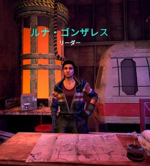
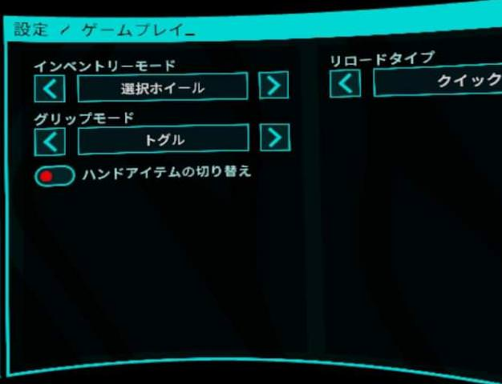

# 初心者向けガイド

## チュートリアル後の進め方
リーダーのルナに話しかけて、指定されたステージをクリアしていく。難易度はいちばん簡単なサバイバーがオススメ。すべての収穫作戦(ステージ)をクリアすると、ミサイルランチャーという強い武器がもらえる。

## ストーリー後の遊び方
特に決まった遊び方はないが、武器のアタッチメント集め、スキンの開放、知り合いとワイワイ、高難易度クリアなど。私は高難易度ソロクリアを目指して楽しんでいます。

## 重要な設定
* 移動：テレポート移動は早い、酔いにくい、という利点があるが、操作が難しい。一方、スライディング移動は直感的でプレイしやすい。  

* リロード：最初は操作しやすいクイックリロードがオススメ。マニュアルリロード(上級リロード)は、クイックリロードに比べて+35%のダメージが加算される。  
