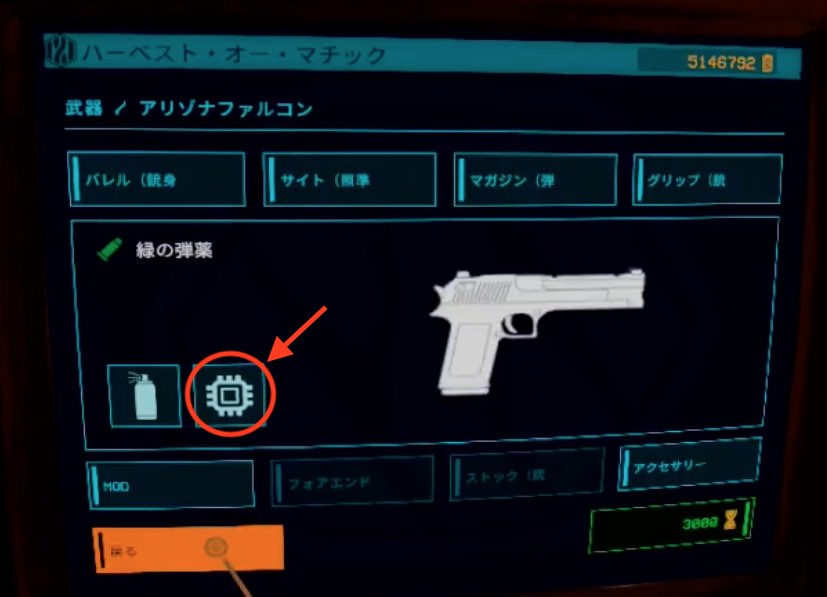
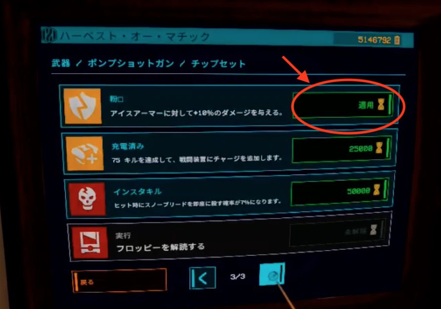

# チップセット

- チップセットとは、武器を強化するアイテム
- ミューテーターランのクリア報酬で入手
- 効果は武器共通だが、武器ごとに効果の数値が異なる(例：即死効果の場合、ピストルは10%、ポンプショットガンは15%など)
- 武器庫で武器一つに1個装備可能。チップ購入後、「適用」を押し、「装備」になると装備完了。効果のマークが武器のサイドに表示される

## 効果一覧

効果は武器ごとに異なる。以下は制式ピストルの場合

| 出現レア度 (フロッピー色) | 名称 |　効果|
|----|----|----|
| 青 | フラットリコイル | リコイル -15% |
| 青 | フラットダメージ | ダメージ +5% |
| 青 | フラットマグ | マガジン +20% |
| 青 | フラットクリティカル | クリティカル率 +10% |
| むらさき | 最後の砦 | 体力が25%を下回るとダメージ2倍 |
| むらさき | ブラッドフェスト | スペシャルを倒したとき、30秒間ダメージと発射速度が1.5倍 |
| むらさき | マグミン | マガジンにないラウンドごとに、累積ダメージ +0.3% (詳細不明...) |
| 黄色 | 冷凍プール | 1発ごとに 10% の可能性で弾を消費しない |
| 黄色 | 粉々 | アイスアーマーに対して 15% のダメージ |
| 黄色 | 充電済み | 75キルごとにデバイスチャージ |
| 赤 | インスタキル | 3% の確率で即死させる |
| 赤 | フルオート | トリガー押しっぱなしで連射するが、ダメージ -25% |
| 赤 | バーストファイア | 1トリガーで3発発射するが、ダメージ -10% |
| 赤 | 実行 | 敵の体力が 10% 以下になったら即死 |

## オススメ構成
- ショットガン＆冷凍プール ： 弾薬がほぼ無限になる。リロードする必要がほぼないので、手動リロードにして+50%ダメージにするのがオススメ。
