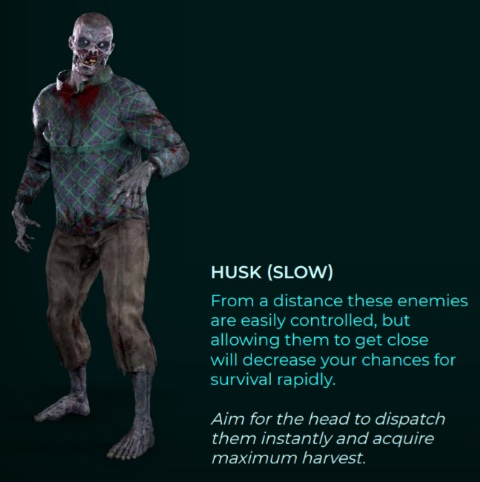

# 敵ごとの攻略

## 敵の体力
スマッシャー ＞ ジャガノート ＞ イーター ＞ ブルート ＞ スキマー ＞ ハスク。 ※公式値ではなく、私の体感

## 敵が現れた合図
鳴き声が敵が現れた合図。方角も分かる。ジャガノートなどのスペシャルは特有の鳴き声なので、覚えておくと、どの敵が現れたかわかる(ジャガノートは鳴き声ではなくBGM)。敵がいなくなるとBGMは通常に戻る。

## ハスク(slow)
ゾンビっぽいやつ。歩いてくるので遅い。ヘッドショットで一撃。足を撃つと這いずりになる。アイスアーマーがついていないので弱い。難易度マスター以上にはほぼ出てこない。

## ジャガノート
速度が遅いので、走ってくるスノウブリードを先に倒すとよい。ダメージが高いヘッドショットがオススメ。捕まって5秒ほどすると即死する。捕まってもよろめき効果を与えるか、倒し切ると開放される。捕まっている間にヘッドショットをたくさん当てて倒すか、ミサイルを当ててよろめき効果を与えるとよい。

## ブルート
みんな嫌いなブルート。足が早くて、耐久力があり、攻撃が早い。見つけたら一番早く倒す。体力は少ないので、頭を打ち続けると早く倒せる。大量のスノウブリードと現れたら、迷わずミサイルやボムを使うとよい。よろめき効果で止まってる間に倒し切る。

## イーター
死ぬときに爆発する。爆発に巻き込まれると、５秒くらい暗闇状態になる。ジュースブースターで暗闇状態を回復することができる。爆発は敵も巻き込むので、積極的に狙うとよい。

## スキマー
スキマーを倒すと追加フロッピーと数百のハーベストが入手できる。逃げ足が速いので、弾頭で即死させるか、ミサイルやパイプボムで足止めしつつ、高火力の武器で倒し切るとよい。

## スマッシャー
各部位がスノウアーマーで覆われていて、スノウアーマーを剥がすと地肌に攻撃が通る。地肌の部位を壊すと、よろめく。壊れていない部位を攻撃しても意味がないので、壊していない部位を探す。壊れていない部位の地肌は、撃つとオレンジ色に光る。攻撃パターンは少なく、基本的に足は遅いので、スノウブリードや他のスペシャルを倒してから倒すと良い。
