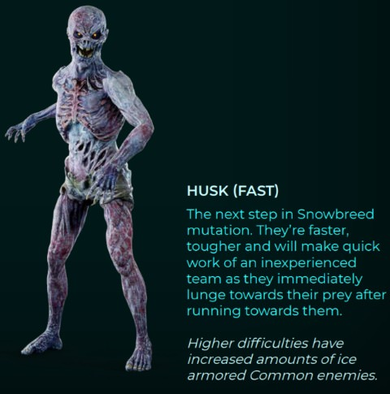
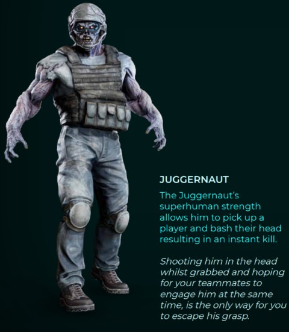
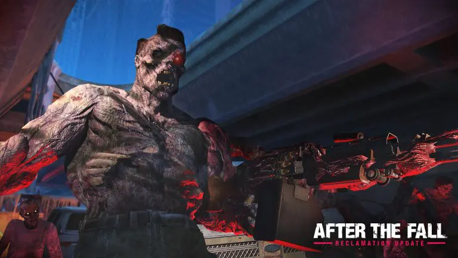
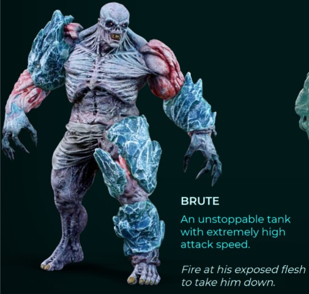
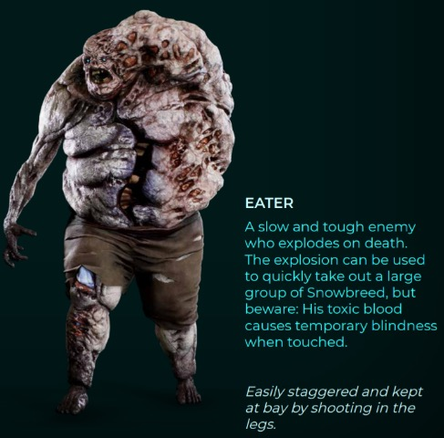
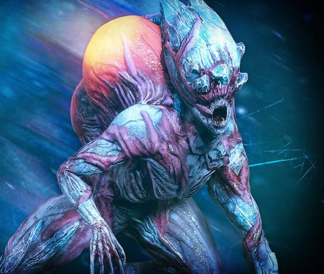
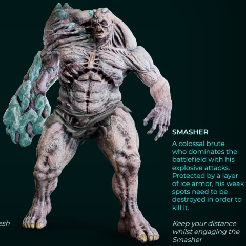

# 敵
敵とその特徴

## 敵の体力
スマッシャー ＞ ジャガノート ＞ イーター ＞ ブルート ＞ スキマー ＞ ハスク。 ※公式値ではなく、私の体感

## 敵が現れた合図
鳴き声が敵が現れた合図。方角も分かる。ジャガノートなどのスペシャルは特有の鳴き声なので、覚えておくと、どの敵が現れたかわかる(ジャガノートは鳴き声ではなくBGM)。敵がいなくなるとBGMは通常に戻る。

## ハスク(slow)
ゾンビっぽいやつ。歩いてくるので遅い。ヘッドショットで一撃。足を撃つと這いずりになる。アイスアーマーがついていないので弱い。難易度マスター以上にはほぼ出てこない。

## ハスク(FAST)
ハスク(slow)の進化版。走ってきたり、スノウアーマーを着てたりして強い。スノウアーマーがついている部位はハスクごとに異なるので、うまく狙うと良い。

## ジャガノート
速度が遅いので、走ってくるスノウブリードを先に倒すとよい。ダメージが高いヘッドショットがオススメ。捕まって5秒ほどすると即死攻撃をうける。捕まってもよろめき効果を与えるか、倒し切ると開放される。捕まっている間にヘッドショットをたくさん当てて倒すか、ミサイルを当ててよろめき効果を与えるとよい。

## ジャガノート ガンナー
近距離では通常ジャガノートと同様掴み攻撃をする。長距離では直線上にマシンガンを撃つ。通常ジャガノートより低体力。

## ジャガノート チャージャー
走って突進してきたところに範囲攻撃を放つ。壁や柱の後ろに隠れることで突進を防ぐことができる

## ブルート
みんな嫌いなブルート。足が早くて、耐久力があり、攻撃が早い。見つけたら一番早く倒すべき。スノウアーマーが施されていない部位があるので、そこを狙うと良い。迷うようなら、アーマーがあっても、頭を打ち続けると早く倒せる可能性がある。大量のハスクと現れたら、迷わずミサイルやボムを使うとよい。よろめき状態の間に倒し切ろう。

## イーター
死ぬときに爆発する。爆発に巻き込まれると、５秒ほど暗闇状態になる。ジュースブースターで暗闇状態を回復することができる。爆発は敵も巻き込むので、積極的に狙うとよい。足をうつとよろめき状態になりやすい。

## スキマー
倒すと追加フロッピーと多くのハーベストが入手できる。入手できるフロッピーは、一つ難易度の低いもの(例えばナイトメアだと黄色フロッピー)。逃げ足が速いので、弾頭で即死を狙うか、ミサイルやパイプボムでよろめき状態にさせ、高火力の武器で倒し切る。

## スマッシャー
巨大版ブルート。各部位がスノウアーマーで覆われていて、スノウアーマーを剥がすと地肌に攻撃が通る。地肌の部位を壊すとよろめく。すでに壊した部位を攻撃してもダメージを与えられないので、壊していない部位を探す。壊れていない部位の地肌は、撃つとオレンジ色に光る。攻撃パターンは少ないので、他のスノウブリードを倒してからが良い。距離をとっていればタイマンでも勝てるはず。

