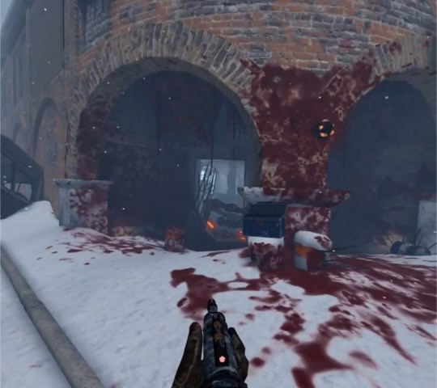

# 収穫作戦のステージ攻略

## 共通
* 強い人とチームを組む
* 武器を強化する
* マップ・配置を覚える

## スキッドロウ
* 序盤、ゲームセンターに入るためスプロールを撃つが、スプロールを撃たずにゲームセンター内を撃つとスノウブリードが湧く。スノウブリードはスプロールを通過できないため、安全に狩れる  

* ゲームセンター1F、2Fには部屋があるが、中に入らなければ敵は湧かない。  

* 最初のセーフルームについた後、屋内に進む。屋内の各部屋にはスノウブリードが居るが、近づかない、攻撃をしないことで無視して次のセーフルームに進める。  

* 二つ目のセーフルーム後のコンテナ前：広いので敵が倒せなそうならトレインする。セーフルーム出たところで待機して、上から撃つのもあり、そこならバックアタックされない。  

* ボス：爆発するドラム缶を活用する。トレインする。色々な方向から敵が湧くので、周りを見つつ戦う。  

## チャイナタウン
## 隔離センター
## ユニオンタワー
## 中継塔

## ブールーバード
* 序盤、以下に見えない弾薬箱がときどきある。  

* 以下にも弾薬箱がときどきある。見えたり見えなかったりする。画像の緑丸内に、うっすらと緑色の弾薬箱が見えるときがある。近くでは見えない。  
