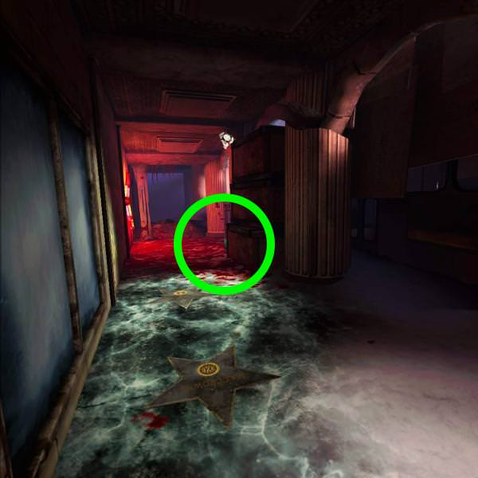

# 収穫作戦のステージ攻略

* [スキッドロウ](#スキッドロウ)
* [チャイナタウン](#チャイナタウン)
* [隔離センター](#隔離センター)
* [ユニオンタワー](#ユニオンタワー)
* [中継塔](#中継塔)
* [大通り](#大通り)

## スキッドロウ
* 以下の攻略動画を監修しました。よろしければご覧ください。 → [スキッドロウ完全攻略 │ 秩父つむぎ](https://www.youtube.com/embed/2tfgFYRB5K8?si=VnNBU5B6ZkC7U9oO)

* 序盤、ゲームセンターに入るためスプロールを撃つが、スプロールを撃たずにゲームセンター内を撃つとスノウブリードが湧く。スノウブリードはスプロールを通過できないため、安全に狩れる  

* ゲームセンター1F、2Fには部屋があるが、中に入らなければ敵は湧かない。  

* 最初のセーフルームについた後、屋内に進む。屋内の各部屋にはスノウブリードが居るが、近づかない、攻撃をしないことで無視して次のセーフルームに進める。  

* 二つ目のセーフルーム後のコンテナ前：広いので敵が倒せなそうならトレインする。セーフルーム出たところで待機して、上から撃つのもあり、そこならバックアタックされない。  

* ボス：爆発するドラム缶を活用する。トレインする。色々な方向から敵が湧くので、周りを見つつ戦う。  

## チャイナタウン
* 最初、セーフルームを出たあとは、上から戦うと攻撃を受けにくい。スノウブリードが登ってくる動作中は動きが止まり、角度的にヘッドショットがしやすい。  

* 戦車ゾーンに行くまでは、ドアを閉めつつ進むとバックアタックされない。一部のドアは閉めたままスノウブリードを撃つことができる。  

* ステージ全体を通して卵ボムが多いので活用する。  

* 戦車エリアは広いのでトレインがしやすい。スノウブリードの鳴き声方向に注意し、バックアタックを受けないようにする。卵ボムもあるので撃つべし。    

* 最初のセーフルーム直後はとても狭いので、少し出て敵を釣ったあと、セーフルームに戻って戦うとよい。イーターなどのスペシャルの声が聞こえたらパイプボムを投げておく。  

* 渡り廊下でたくさんスノウブリードが湧く。さばききれなくなったら、長い廊下までもどって戦うとよい。卵ボムもある。  

* ボスは階段上に籠もるのもよいが、広いフィールドでトレインしながら戦うと追い詰められることがない。 

## 隔離センター
## ユニオンタワー
## 中継塔

## 大通り
* 序盤、以下に見えない弾薬箱がときどきある。  

* 以下にも弾薬箱がときどきある。見えたり見えなかったりする。画像の緑丸内に、うっすらと緑色の弾薬箱が見えるときがある。近くでは見えない。  
