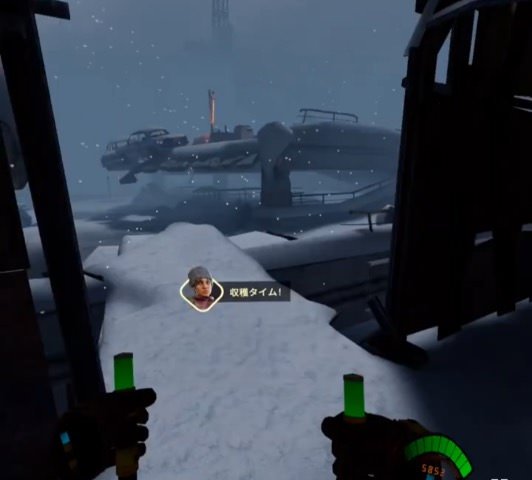

# 収穫作戦のステージ攻略
* [共通](#共通)
* [スキッドロウ](#スキッドロウ)
* [チャイナタウン](#チャイナタウン)
* [隔離センター](#隔離センター)
* [ユニオンタワー](#ユニオンタワー)
* [中継塔](#中継塔)
* [大通り](#大通り)

## 共通

### 基本
* 強い人とチームを組む
* 武器を強化する
* マップ・配置を覚える
* 距離をとって戦う

### 弾薬箱(ammo)
緑弾薬箱は1回のみ回収、紫弾薬箱は時間経過で復活するので何度でも回収できる。紫弾薬箱が回復するまでの時間は、収穫作戦だとおよそ20秒、ホードモードだとおよそ50秒。

### 弾薬の自動回復
詳しい条件は不明だが、弾薬が一定以下、かつスノウブリードの波が収まったタイミングで、弾薬が一定数まで回復する。弾が不足しがちな高難易度のユニオンタワーなどで重宝する。

### 弾薬を常に満タンにする
スノウブリードの波が収まったら、次の会敵に備えて銃のマガジンをフルにしとくとよい。以下の手順で、弾を無駄にすることなく弾薬を装填できる。
1. マガジンを落とす
1. マガジンを回収する
1. リロードする

やや慣れが必要。銃を持っていない手でマガジンを回収すると早い。銃によってマガジンが排出される方向が異なるので注意(リボルバーは後ろに排出され、見失いがち)

### 卵ボム
正式名称不明。いろいろなところに生えていて、撃つと爆発して近くにいるスノーブリードにダメージを与える。スペシャルにはよろめき効果を与える。味方にダメージはないが、数秒間暗闇状態になる。弾の節約になり、数十秒で再度生えるので、敵を引きつけて積極的に撃つとよい。

### ボムをすぐに爆発させる
起動していないボム、起動して投げたボムは、撃つことで爆発する。敵が目の前にたくさん迫っているとき、敵がボムを通り過ぎそうなときに有用。ブルートが迫っているときによく使います。

### トレイン
大量の敵に追われつつ、逃げながら戦うこと(大量の敵を後続車両にみたててトレインと呼ぶ)。ある程度のスペースが必要。テレポ移動ならば振り返って撃つ余裕もできるが、スライディング移動だと常に移動しつつ撃つ必要がある。高難易度で重宝する。ボス部屋でよく使う。

## スキッドロウ
* 序盤、ゲームセンターに入るためスプロールを撃つが、スプロールを撃たずにゲームセンター内を撃つとスノウブリードが湧く。スノウブリードはスプロールを通過できないため、安全に狩れる  

* ゲームセンター1F、2Fには部屋があるが、中に入らなければ敵は湧かない。  

* 最初のセーフルームについた後、屋内に進む。屋内の各部屋にはスノウブリードが居るが、近づかない、攻撃をしないことで無視して次のセーフルームに進める。  

* 二つ目のセーフルーム後のコンテナ前：広いので敵が倒せなそうならトレインする。セーフルーム出たところで待機して、上から撃つのもあり、そこならバックアタックされない。  

* ボス：爆発するドラム缶を活用する。トレインする。色々な方向から敵が湧くので、周りを見つつ戦う。  

## チャイナタウン
## 隔離センター
## ユニオンタワー
## 中継塔

## 大通り
* 序盤、以下に見えない弾薬箱がときどきある。  

* 以下にも弾薬箱がときどきある。見えたり見えなかったりする。画像の緑丸内に、うっすらと緑色の弾薬箱が見えるときがある。近くでは見えない。  
