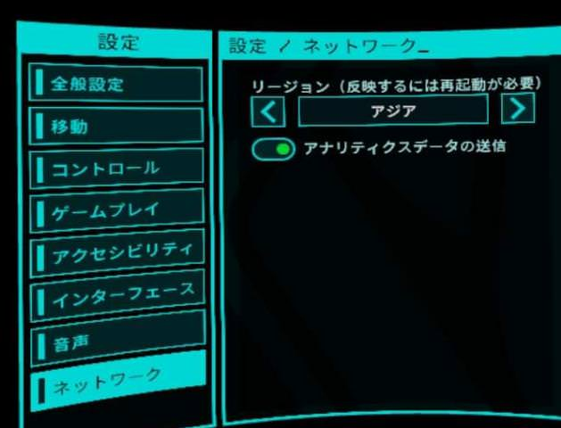

# その他Tips

## アイテムの価格
難易度が高いほど高価。ナイトメアでの弾頭の値段は10,000ハーベスト。

## 人が少ないとき
ネットワークを北米リージョンにすると、人が多い気がする。物理的に遠く、遅延が大きいためか、接続切れが多い気がする。

## キャリブレーションスキップ
起動後のキャリブレーションは設定でスキップできる。

## たくさんのアイテムを効率的に運ぶ
両手、両手首ストックで4つずつ運ぶことができる。ハーベスト・オー・マチックでの購入制限ができたので使わないか。
