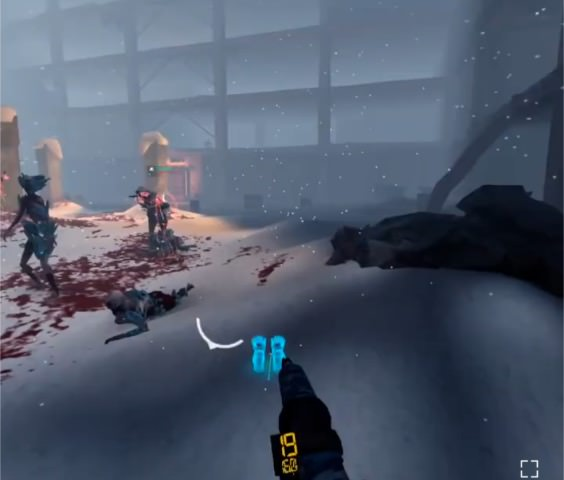

# ソロ・ナイトメア攻略

## 共通

### テレポ移動のTips
* 利き手と逆のスティックでサイドステップ、バックステップができる。これにより、さがりながら撃つ、スライドして仲間と射線がかぶらないようにすることが可能。
* テレポ先を決めたあと、スティックを曲げることで、テレポ先で向きを変えることが可能。曲がり角でいきなり正面を向ける。

### マップの把握
敵が湧く位置などを覚えてバックアタックされないようにする。弾薬箱、氷像の位置も重要。安全地帯も活用する。

[安全地帯の参考動画 │ YouTube](https://youtu.be/trxI8ceg3ZI)

### 敵襲来インジケーターの利用
見ていない方向から敵が近づくと、白いインジケーターが出る。出たらダッシュで距離を取る。設定でオフにできる

### 銃の弾薬カウンターを外す
外すことで、敵によろめき効果を与える確率が2.5%上昇する。以下のTipsを使えば弾薬カウンターは不要。

[弾薬を常に満タンにする](https://github.com/neopage/AfterTheFall/wiki/%E3%82%B9%E3%83%86%E3%83%BC%E3%82%B8%E5%85%B1%E9%80%9A%E3%81%AETips##%E5%BC%BE%E8%96%AC%E3%82%92%E5%B8%B8%E3%81%AB%E6%BA%80%E3%82%BF%E3%83%B3%E3%81%AB%E3%81%99%E3%82%8B)

## ソロ攻略

### AIを使い倒す
AIの持つ弾・ジュースブースターは無限。AIを先行させ、AIに群がる敵を倒すとよい。また、ジュースが余ったらAIに打つとよい。

### トレイン
特にボスではAIが死にがち。一人で多くの敵を倒すにはトレインが必須。

### 安全地帯を活用する
ステージによっては安全地帯がある。ソロだと他人の目を気にせず活用できる。チームメンバーがドアを開けてしまう心配もない。
[安全地帯 - After the Fall | YouTube](https://youtu.be/trxI8ceg3ZI)

## ナイトメア攻略

### 4人で挑む
AIより人間の方が基本的に役立つ。なるべく固まって、お互いをサポートするように進めるとよい。

### 武器を改造する
できるだけ改造する。デフォルト装備だとキツイ。

### 早めにボム、コンバットデバイスを使う
死ぬ前にすべてのアイテムを使ってから死ぬべし。早めにさばききれそうと判断しアイテムを使う。パイプボム、ミサイルは爆発・着弾まで時間がかかるので早めに使う。

### スノウブリードの足を狙う
ヘッドショットで即死させたいが、無効化重視で、当てやすい足を狙うと良い。這いずりの敵は、弾の節約のためにAIに倒させる。

### 弾薬の節約
ユニオンタワーの序盤など、弾薬が不足しがち。以下の方法で弾薬を節約するとよい。

### 4種類の弾薬を使う
* 弾薬箱を回収すると、4種類すべての弾薬が回復する。満タンの弾薬を回復するのはもったいないので、なるべくすべて使いきった状態で弾薬箱を回収したい。
* 私は、余裕を持って倒せる場合はリボルバー、次になるべく近づいてショットガン、最後にLMG or SMGを使う。

### 弾薬の自動回復を活用する
ショットガンは20発も自動回復する。積極的に使っていきたい。

### ジップライン前で待機
ロープで滑走するところ。一人だけ先に進み、残りは渡らず待機。人間が二人以上必要。敵は渡れないので勝ち確。スキッドロウの序盤と、ブールバードの後半で使える。

