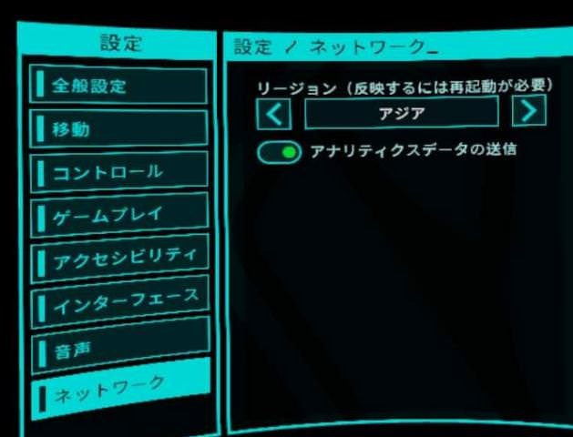

# お役立ち情報

収穫作戦でのTips、用語、トリビアなどをまとめました。

* [収穫作戦Tips](#収穫作戦Tips)
* [トリビア](#トリビア)
* [用語](#用語)

## 収穫作戦Tips

### 基本
* 強い人とチームを組む
* 武器を強化する
* マップ・配置を覚える
* 距離をとって戦う

### 弾薬箱(ammo)
緑弾薬箱は1回のみ回収、紫弾薬箱は時間経過で復活するので何度でも回収できる。紫弾薬箱が回復するまでの時間は、収穫作戦だとおよそ20秒、ホードモードだとおよそ50秒。

### 弾薬の自動回復
詳しい条件は不明だが、弾薬が一定以下、かつスノウブリードの波が収まったタイミングで、弾薬が一定数まで回復する。弾が不足しがちな高難易度のユニオンタワーなどで重宝する。

### 弾薬を常に満タンにする
スノウブリードの波が収まったら、次の会敵に備えて銃のマガジンをフルにしとくとよい。以下の手順で、弾を無駄にすることなく弾薬を装填できる。
1. マガジンを落とす
1. マガジンを回収する
1. リロードする

やや慣れが必要。銃を持っていない手でマガジンを回収すると早い。銃によってマガジンが排出される方向が異なるので注意(リボルバーは後ろに排出され、見失いがち)

### 卵ボム
公式ではスプロールポッド(スプロールの卵)と呼ばれているが、ここでは卵ボムと呼ぶ。いろいろなところに生えていて、撃つと爆発して近くにいるスノーブリードにダメージを与える。スペシャルにはよろめき効果を与える。味方にダメージはないが、数秒間暗闇状態になる。弾の節約になり、数十秒で再度生えるので、敵を引きつけて積極的に撃つとよい。

### ボムをすぐに爆発させる
起動していないボム、起動して投げたボムは、撃つことで爆発する。敵が目の前にたくさん迫っているとき、敵がボムを通り過ぎそうなときに有用。ブルートが迫っているときによく使います。

### トレイン
大量の敵に追われつつ、逃げながら戦うこと(大量の敵を後続車両にみたててトレインと呼ぶ)。ある程度のスペースが必要。テレポ移動ならば振り返って撃つ余裕もできるが、スライディング移動だと常に移動しつつ撃つ必要がある。高難易度で重宝する。ボス部屋でよく使う。

### テレポ移動のTips
* 利き手と逆のスティックでサイドステップ、バックステップができる。これにより、さがりながら撃つ、スライドして仲間と射線がかぶらないようにすることが可能。
* テレポ先を決めたあと、スティックを曲げることで、テレポ先で向きを変えることが可能。曲がり角でいきなり正面を向ける。

### マップの把握
敵が湧く位置などを覚えてバックアタックされないようにする。弾薬箱、氷像の位置も重要。安全地帯も活用する。

[安全地帯の参考動画 │ YouTube](https://youtu.be/trxI8ceg3ZI)

### 敵襲来インジケーターの利用
見ていない方向から敵が近づくと、白いインジケーターが出る。出たらダッシュで距離を取る。設定でオフにできる

### 銃の弾薬カウンターを外す
外すことで、敵によろめき効果を与える確率が2.5%上昇する。以下のTipsを使えば弾薬カウンターは不要。

[弾薬を常に満タンにする](https://github.com/neopage/AfterTheFall/wiki/%E3%82%B9%E3%83%86%E3%83%BC%E3%82%B8%E5%85%B1%E9%80%9A%E3%81%AETips#%E5%BC%BE%E8%96%AC%E3%82%92%E5%B8%B8%E3%81%AB%E6%BA%80%E3%82%BF%E3%83%B3%E3%81%AB%E3%81%99%E3%82%8B)

### AIを使い倒す
AIの持つ弾・ジュースブースターは無限。AIを先行させ、AIに群がる敵を倒すとよい。また、ジュースが余ったらAIに打つとよい。

### トレイン
特にボスではAIが死にがち。一人で多くの敵を倒すにはトレインが必須。

### 安全地帯を活用する
ステージによっては安全地帯がある。ソロだと他人の目を気にせず活用できる。チームメンバーがドアを開けてしまう心配もない。
[安全地帯 - After the Fall | YouTube](https://youtu.be/trxI8ceg3ZI)

### 4人で挑む
AIより人間の方が基本的に役立つ。なるべく固まって、お互いをサポートするように進めるとよい。

### 武器を改造する
できるだけ改造する。デフォルト装備だとキツイ。

### 早めにボム、コンバットデバイスを使う
死ぬ前にすべてのアイテムを使ってから死ぬべし。早めにさばききれそうと判断しアイテムを使う。パイプボム、ミサイルは爆発・着弾まで時間がかかるので早めに使う。

### スノウブリードの足を狙う
ヘッドショットで即死させたいが、無効化重視で、当てやすい足を狙うと良い。這いずりの敵は、弾の節約のためにAIに倒させる。

### 弾薬の節約
ユニオンタワーの序盤など、弾薬が不足しがち。以下の方法で弾薬を節約するとよい。

### 4種類の弾薬を使う
* 弾薬箱を回収すると、4種類すべての弾薬が回復する。満タンの弾薬を回復するのはもったいないので、なるべくすべて使いきった状態で弾薬箱を回収したい。
* 私は、余裕を持って倒せる場合はリボルバー、次になるべく近づいてショットガン、最後にLMG or SMGを使う。

### 弾薬の自動回復を活用する
ショットガンは20発も自動回復する。積極的に使っていきたい。

### ジップライン前で待機
ロープで滑走するところ。一人だけ先に進み、残りは渡らず待機。人間が二人以上必要。敵は渡れないので勝ち確。スキッドロウの序盤と、ブールバードの後半で使える。

## トリビア

### アイテムの価格
難易度が高いほど高価。ナイトメアでの弾頭の値段は10,000ハーベスト。

### 人が少ないとき
ネットワークを北米リージョンにすると、人が多い気がする。物理的に遠く、遅延が大きいためか、接続切れが多い気がする。

### キャリブレーションスキップ
起動後のキャリブレーションは設定でスキップできる。

### たくさんのアイテムを効率的に運ぶ
両手、両手首ストックで4つずつ運ぶことができる。ハーベスト・オー・マチックでの購入制限ができたのであわり使われない。

### グリッチ、チート、バグ
壁抜けのグリッチ、無限連射のチートが観測されています。ゲームバランスを崩す迷惑行為とされているので報告しましょう。設定→チーム→名前→報告。

## 用語

### ザ・ライン
スノウブリードと戦う拠点。チュートリアル後につれていかれるところ。

### ハーベスト・オー・マチック
セーフルームでアイテムを買ったり、収穫作戦に参加したりするアーケードゲーム台のこと。

### ハーベスト
お金。収穫作戦中のマシンでのアイテム購入、武器の強化パーツ購入などに使う。

### スノウブリード
AFTに出てくる敵の総称。ハスクからスマッシャーまで。

### スペシャル
スノーブリード以外の敵。スマッシャー、ジャガノート、イーター、ブルート、スキマー

### 収穫作戦
スノウブリード、スペシャルなどのCPU敵を各ステージで倒すモードのこと。

### ホードモード
ホード(horde)は大群を意味。マップを探索するのではなく、1つの場所にとどまって無限に湧く敵を倒し続けるモード。

### タンドラドーム
対人戦。あまり流行ってない。
