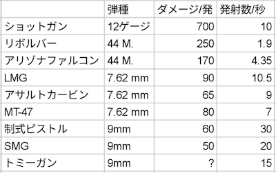

# 武器・アイテム

## 未改造の銃のスペック一覧

* ショットガンは1発70ダメージ、10発同時発射
* 制式ピストルはオートではないので、実際30発/秒 撃つのは困難
* 銃についている弾薬カウンターを外すと、よろめき効果を与える確率2.5%上昇
* 上級リロードを使うとダメージ35%上昇

## フロッピー
フロッピーは新アイテムやアタッチメントを開放する。セーフルームのハーベスト・オー・マチックに挿入する、あるいはクリア時に持っているとクリア後に報酬となる。収穫作戦の難易度によって、基本報酬のランクが異なる。報酬のランクは以下のようにフロッピーの色で分かれている。括弧内はアタッチメントのクラス。難しい難易度なほど、良い報酬となる。

* サバイバー：青フロッピー(輸入)
* ベテラン：紫フロッピー(工業)
* マスター：黄フロッピー(軍事)
* ナイトメア：赤フロッピー(試作)

一定の確率で上位の難易度のフロッピーをマップ内で拾得できる。マスターでの赤フロッピー拾得率は7.5%、ナイトメアでの赤フロッピー拾得率は20%。

## パイプボム
ボタンを押して一定時間で爆発する。投げたあと銃で撃つと、すぐに爆発する。起動してなくても銃で撃つと爆発する。起動後にもう一度ボタンを押すと起動を解除できる。起動して投げたあとは、もう一度拾ってボタンを押しても解除できない。スペシャルによろめき効果を与える。

## 弾頭(ウォーヘッド)
紫フロッピーからアンロックされる。威力は高いが範囲は狭い。ダメージは9000。スマッシャー以外のスペシャルも一撃で倒せる。自分含む味方にもダメージを与えるバグ(？)があるので注意。

## 衝撃波装置(ショックウェーブデバイス)
赤フロッピーからアンロックし、武器庫のマシンから100,000ハーベストで購入。購入時、回収した手に装着される。左右の入れ替えはできないので注意。ダメージに加え、よろめき効果(敵が止まる)を与える。ミサイルランチャーより弱い。1回のデバイスチャージで2回使える。

## ミサイルランチャー
最大12の敵をロックオンする。撃ってから着弾まで数秒かかるので、危険を察知したら早めに撃つとよい。ダメージに加え、よろめき効果(敵が止まる)を与える。大量のスノーブリードと、スペシャルが出てきたときなどに有用。1回のデバイスチャージで1回使える。

## デバイスチャージ
衝撃波装置とミサイルランチャーは、ハーベスト・オー・マチックからデバイスチャージを購入する、あるいは拾うことで回数を増やすことができる。衝撃波装置とミサイルランチャーを左右の手にそれぞれ装備した場合、1回目のデバイスチャージで両手それぞれにチャージされる。両手に同じものを装備しても、同じものとみなされて1回分しかチャージされない、右手で撃った場合、左手のカウントも減る。

## ジュースブースター
回復量大

## レイジブースター
青フロッピーからアンロック。回復量小。10秒間、発射速度2倍。画面が赤くなるので使いづらい。ジュースブースターを使うと効果がなくなる。

## 小道具
鎮静剤、ビン、マグカップ、空き缶など、手で持てて、名前が表示されるアイテムがある。特になんの効果もない小道具。敵に当ててもダメージなし。ビンは割れる。
