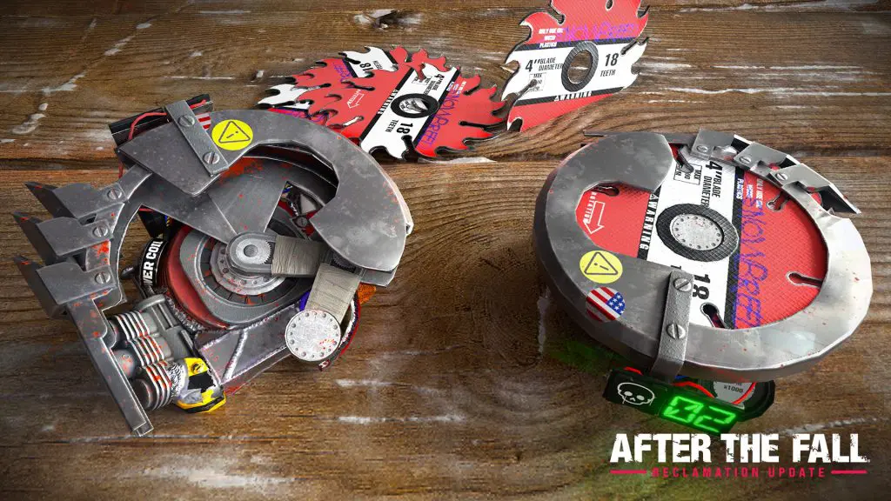

# 武器・アイテム

## 未改造の銃のスペック一覧

銃種|弾種|ダメージ/発|発射数/秒
---|---|---|---
自動ショットガン|赤|700|10
ポンプショットガン|赤|750|10
リボルバー|緑|250|1.9
アリゾナファルコン|緑|170|4.35
LMG|黄|90|10.5
アサルトカービン|黄|65|9
MT-47|黄|80|7
制式ピストル|青|60|30
SMG|青|50|20
トミーガン|青|65|15

* ショットガン1弾あたりのダメージは、1/10
* 制式ピストルはオートではないので、実際30発/秒(撃つのは困難だが)
* 銃についている弾薬カウンターを外すと、よろめき効果を与える確率+10%
* 上級リロードを使うとダメージ+50%

## フロッピー

フロッピーは新アイテムや武器のアタッチメントを開放する。セーフルームのハーベスト・オー・マチックに挿入する、あるいはクリア時に持っているとクリア後に報酬となる。収穫作戦の難易度によって、基本報酬のランクが異なる。報酬のランクは以下のようにフロッピーの色で分かれている。括弧内はアタッチメントのクラス。難しい難易度なほど、良い報酬となる。

* サバイバー：青フロッピー(輸入)
* ベテラン：紫フロッピー(工業)
* マスター：黄フロッピー(軍事)
* ナイトメア：赤フロッピー(試作)

一定の確率で上位難易度のフロッピーをマップ内で拾得できる。マスターでの赤フロッピー拾得率は7.5%、ナイトメアでの赤フロッピー拾得率は20%。赤フロッピーを見つけるとテンションがあがりつつも緊張感が増す。

## パイプボム

ボタンを押して一定時間で爆発する。投げたあと銃で撃つとすぐに爆発する。起動してなくても銃で撃つと爆発する。起動後にもう一度ボタンを押すと起動を解除できる。起動して投げたあとは、もう一度拾ってボタンを押しても解除できない。スペシャルによろめき効果を与える。

## 弾頭(ウォーヘッド)

紫フロッピーからアンロックされる。威力は高いが範囲は狭い。ダメージは9000。スマッシャー以外のスペシャルも一撃で倒せる(ナイトメアのジャガノートは倒せない)。自分含む味方にもダメージを与えるバグ(？)があるので注意。パイプボムの4倍の価格、ナイトメアだと1万ハーベストもする。

## ソウブレード(のこぎり刃)デバイス

赤フロッピーからアンロック。購入時、回収した側の手に装着される。左右の入れ替えはできないので注意。1000ダメージで、壁などで15回バウンドするか、敵を15体倒すことで消滅する。1回のデバイスチャージで3回使える。

## 衝撃波装置(ショックウェーブデバイス)

赤フロッピーからアンロックされ、武器庫のマシンから100,000ハーベストで購入できる。購入時、回収した側の手に装着される。左右の入れ替えはできないので注意。ダメージに加え、よろめき効果(敵が止まる)を与える。ミサイルランチャーより弱い。1回のデバイスチャージで2回使える。

## ミサイルランチャー

最大12の敵をロックオンする。撃ってから着弾まで数秒かかるので、危険を察知したら早めに撃つとよい。ダメージに加え、よろめき効果(敵が止まる)を与える。大量のスノーブリードと、スペシャルが出てきたときなどに有用。1回のデバイスチャージで1回使える。

## デバイスチャージ
コンバットデバイス(衝撃波装置とミサイルランチャー)は、ハーベスト・オー・マチックからデバイスチャージを購入する、あるいは拾うことで回数を増やすことができる。衝撃波装置とミサイルランチャーを左右の手にそれぞれ装備した場合、1回目のデバイスチャージで両手それぞれにチャージされる。両手に同じものを装備しても、同じものとみなされて1回分しかチャージされず、右手で撃った場合、左手のカウントも減る。

## ジュースブースター
回復量大

## レイジブースター

青フロッピーからアンロックされる。回復量小。10秒の間、発射速度が2倍になる。画面が赤くなるので使いづらい。ジュースブースターを使うと効果が消える。

